# LGMD
BME502 Final Project: lobula giant movement detector simulation from *jn.1996.75.3.967*

## Properties should be implemented

1. It should respond to approaching objects and maintain the reponse based on the size, speed, distance, trajectories.
2. It should have a nondirectional response to objects with constant speed and distance.
3. Larger and faster objects should trigger a bigger reponse.

## Results

### Property 1&3

LGMD *in vivo* is observed to be able to respond to approaching objects and maintain the response. So first we simulated a rectangle with a 75x75 size, approaching with a speed of 10m/s. It can be seen from the result that our LGMD network responded to the approaching object rapidly and its output decay exponentially only when the object stopped moving at 40ms:

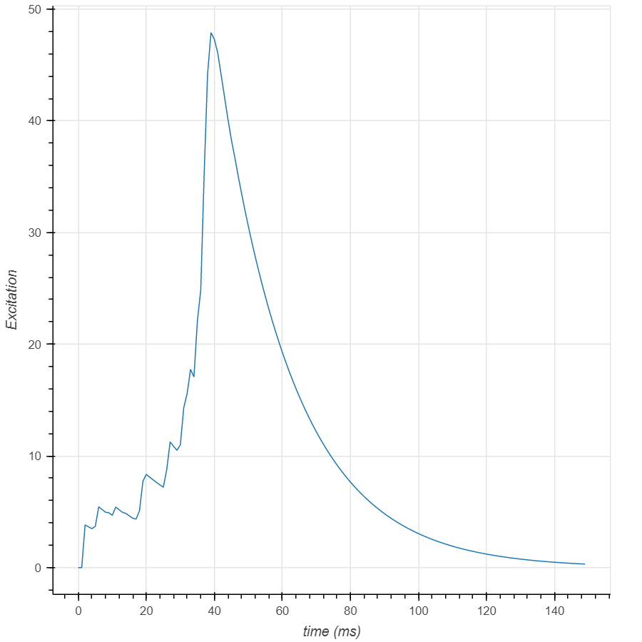

Then we want to examine whether this network can produce different output amplitude when the properties of the object changes:

**Size:**

Bigger size results in larger output.

**Speed:**

Larger approaching velocity results in larger output.

**Distance:**

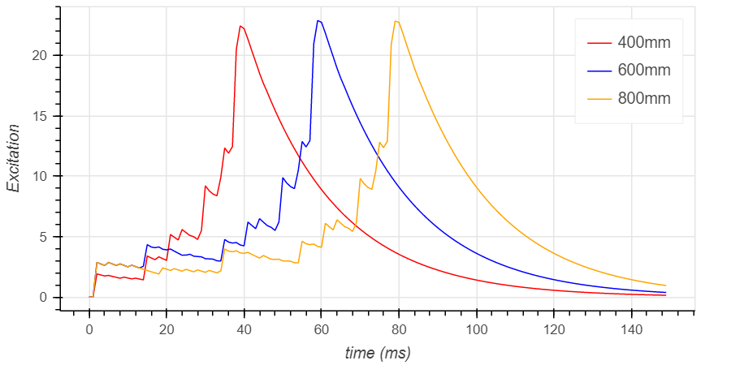

The closer the object is placed, the less time LGMD network needs to reach to the peak. However, the shape of the excitation curve won't change.

**Recede:**

Receding objects tend to trigger an excitation peak and then decay exponentially. This peak may be because the units are adapting to the object after which there would be no response. 

**Trajectory:**

To examine the relationship between trajectories and the reponses of LGMD network, we recorded outputs of different units: 
This is the figure of the E-units' output when an object is moving from left to right. It can be seen that the output of E-units follow the trace of the object's border:

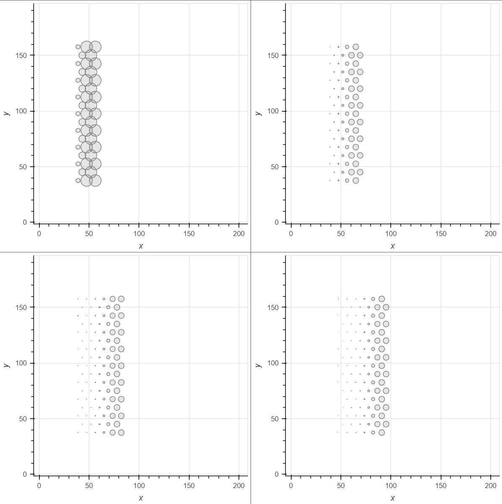

I-units in our network share the similar properties with the E-unit:

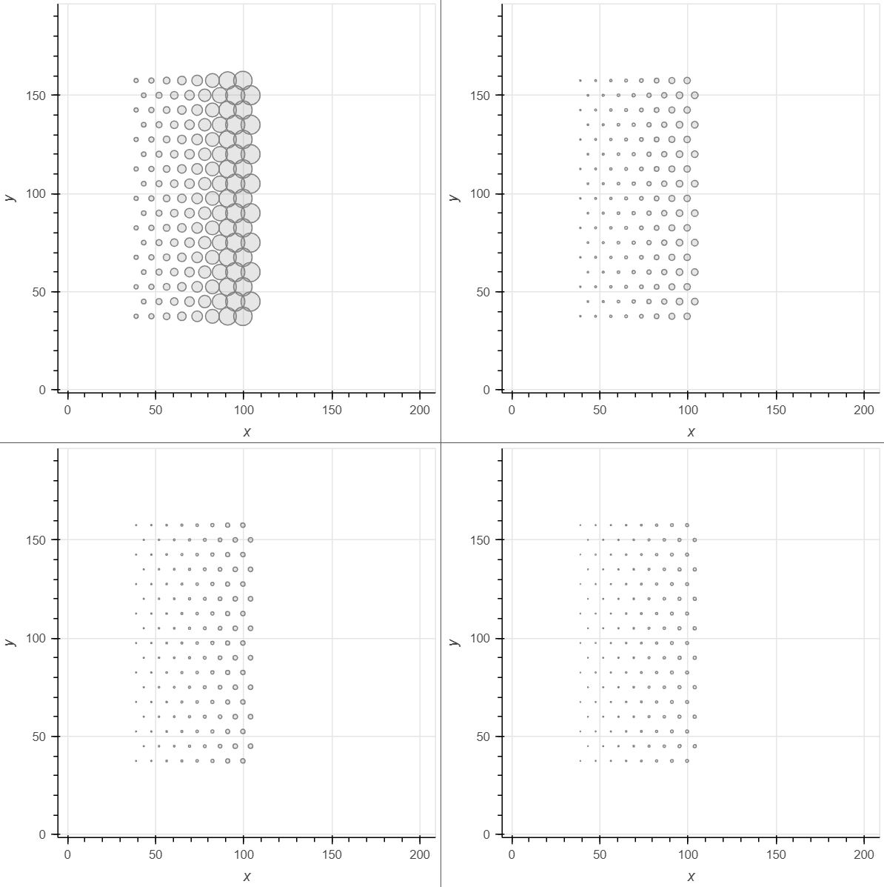

The output of S-units is delineated in the form of a `.gif` file:

It is different from the previous units that there's no output or rather small output on the object's border parallel to the y-axis. This is because I-units have a 2ms delay which would inhibit S-units even thought the stimulus is moving forward:

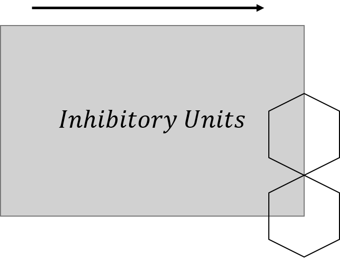

### Property 2

To examine if the network is nondirectional, we simulated an object which moves from left to right and a duplicate moving from right to left with same velocity and distance:

### Compare to Laplace Operator

The structure and output of this LGMD network remind us with a classic border detection operator in the field of image process: Laplace Operator.

A Laplace Operator can be defined as:

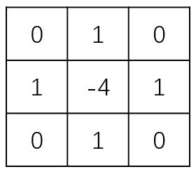

This definition is similar to our LGMD network where an excitatory unit is surrounded by inhibitory units. To compare these two models, we built up a laplace operator in hexagon coordinates like this:

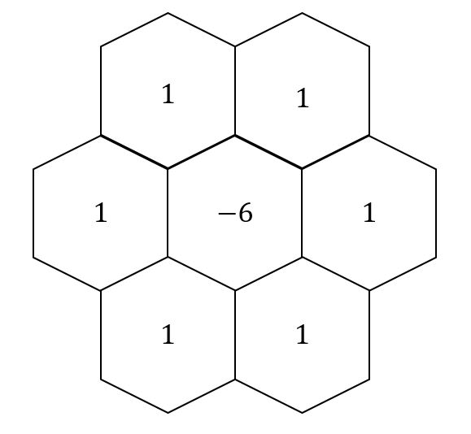

We tested the same movement on both the laplace operator and LGMD network:

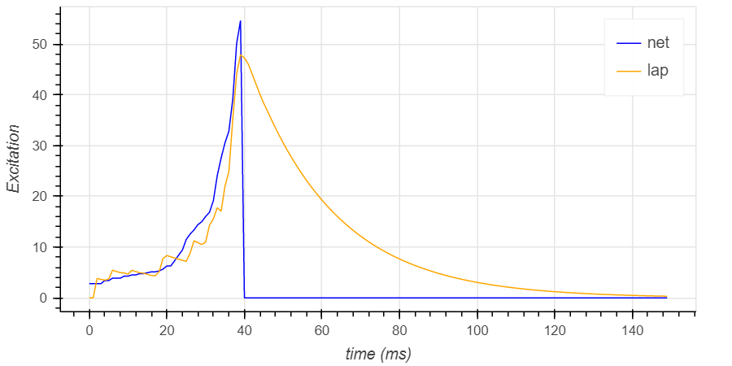

The main difference is that the output of LGMD decays exponentially while the output of laplace operator decays immediately.

We also examined their performences when the size, velocity change:

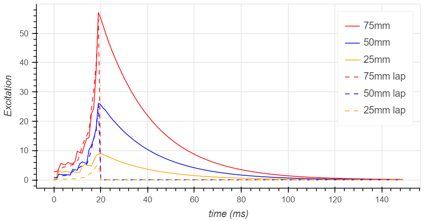

There's no significant difference between these two models except that the results of laplace model are more widely distributed. However, to look into this, we need to use grey scale video in the real world as input, which can not be done now. We may try to implement this part for further study.

## Method

### Network Structure

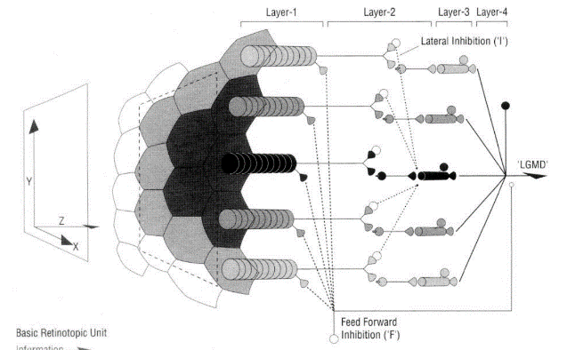

**Our implementation:**

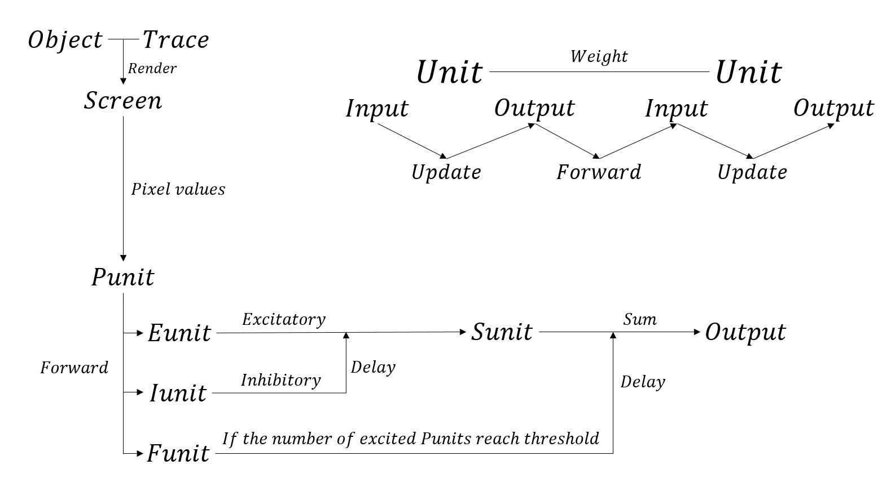

To implement LGMD network, we first defined a basic `unit` class which has several functions shared by all kinds of units. If a unit type needs a specific function, these functions can be easily overwritten:

**Init:** This is where all parameters of a specific unit are set including time constant, refractory time and threshold.

**Update:** This is where the output is calculated. The input of the unit is set by other source units before this `Update` phase via `Forward` function. To calculate the output at a specific time, we have to consider the effect of refractory time. All these calculations are based on a queue whose length is `refractoryTime/timeInterval`:

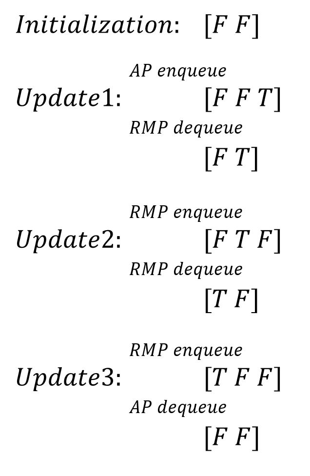

**Forward:** This is where the units set the input of next layer units. The final input of the next layer unit would be a summation of all linked previous layer units' output multiply their weight.

**Reset:** According to our experiment, the initialization of the network is a time-consuming task mostly because of the coordinate system. To make it easier to re-run the network, we use `Reset` function to clear all input/output and other temporary values. The parameter can also be changed after the `Reset`. By doing so, we can immediately re-run the network with the same size and totally different configurations.

### Screen, Object and Coordinates

#### Screen

Here we define screen as a plane where objects are projected to. P-units also get the illumination value on this plane.
We have to use perspective projection instead of orthographic projection because size of the object is important for our purpose. more details can be found on [3D_projection](https://en.wikipedia.org/wiki/3D_projection).

#### Object

There's no need to generate an actual image. Lights can be delivered from the point of the hex to the object on the screen. A simple function can determine the illumination of this point since the object is a rectangle.

Rectangle object maintain a list of position according to speed and interval to simulate movement.

To map the rectangle in space to the screen. First we need to map its origin (top left point) to the screen. Then calculate its width and height on screen to draw its projection. Rotation is not supported in this simple method.

#### Coordinate System

##### Hexagon Coordinates

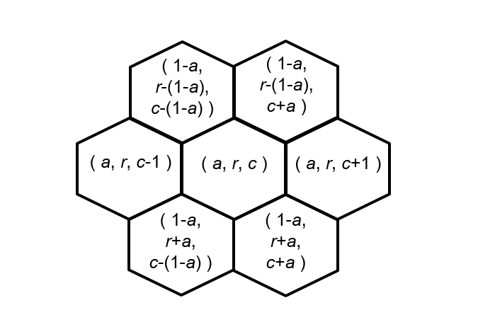
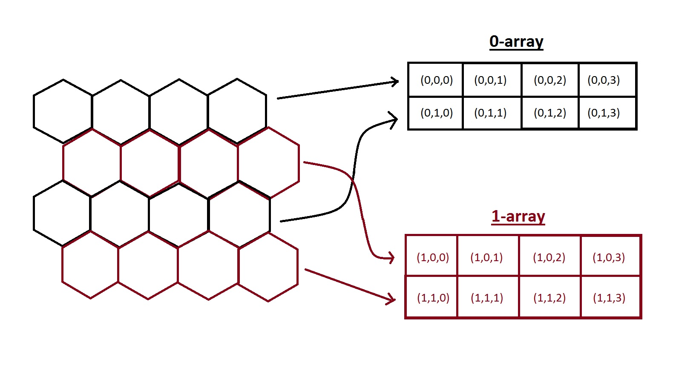

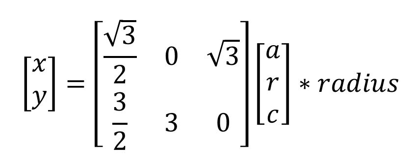
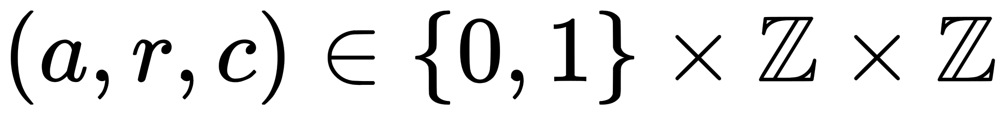

#### Map to Screen

Given a screen, the hexagons should follow this fixed pattern:

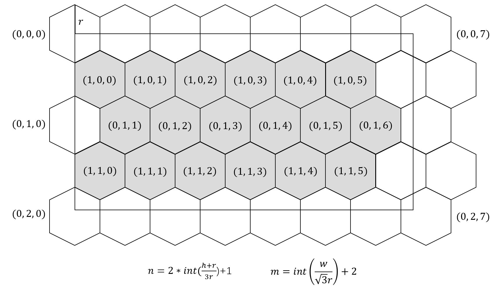

Hexagons rendered in grey are used in the network.

#### Hexagon Radius

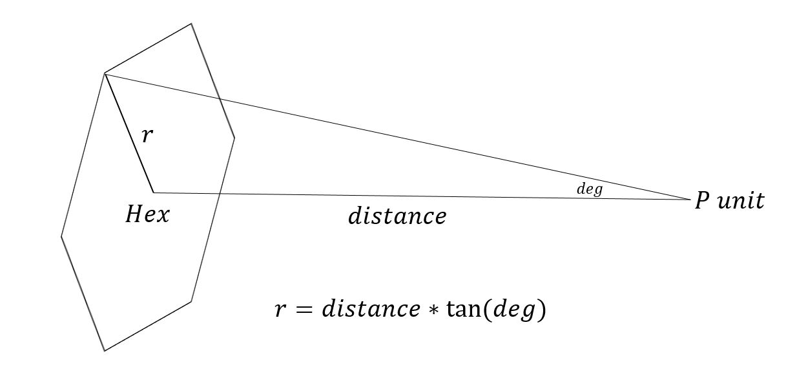

#### Pixel to Hex

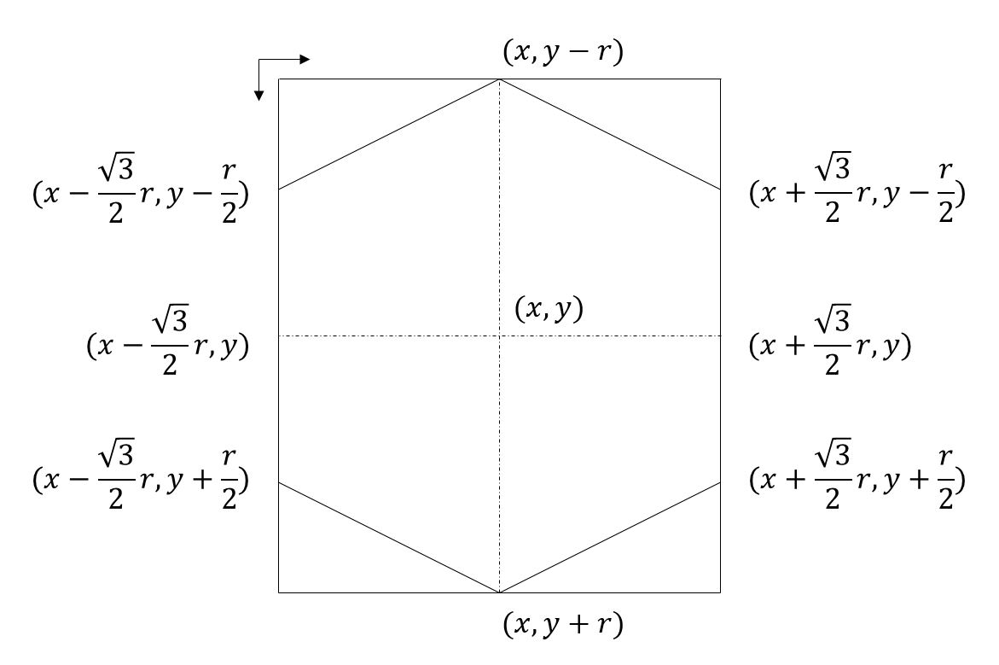
### Movement Generator

This module is used to generate a pixel map of the movement and is a function of `Screen`.

To generate the movement pixel map, this module takes an object and its movement trace as input. `Trace` is defined as a list of 3 dimensional coordinates which represents its position at each time.
#### Default Stimulus Parameters

| Stimulus | Edge Translation | Object Approach |
| :-:| :-: | :-: |
| Initial position $x, y, z,$ mm | -99, 0, 50 | 0, 0, 400 |
| Dimensions $l\times h,$ mm | 100×80 | 75×75 |
| Plane of motion, $(x,y,$ or $z)$ | $x$ | $z$ |
| Direction and distance, mm | 70 | -400 |
| Velocity, m/s | 0.75 | 10 |
