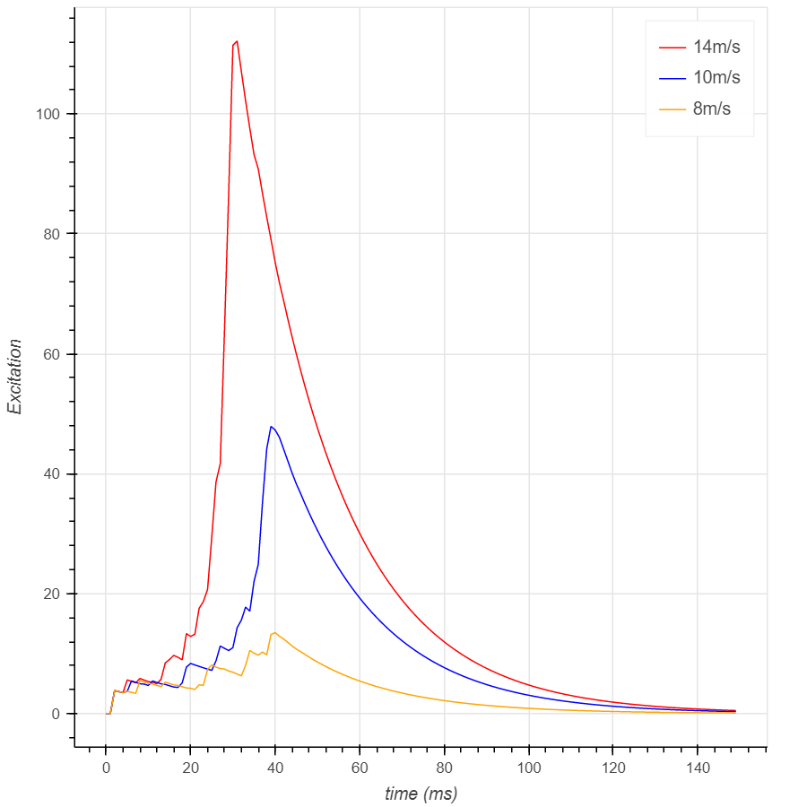
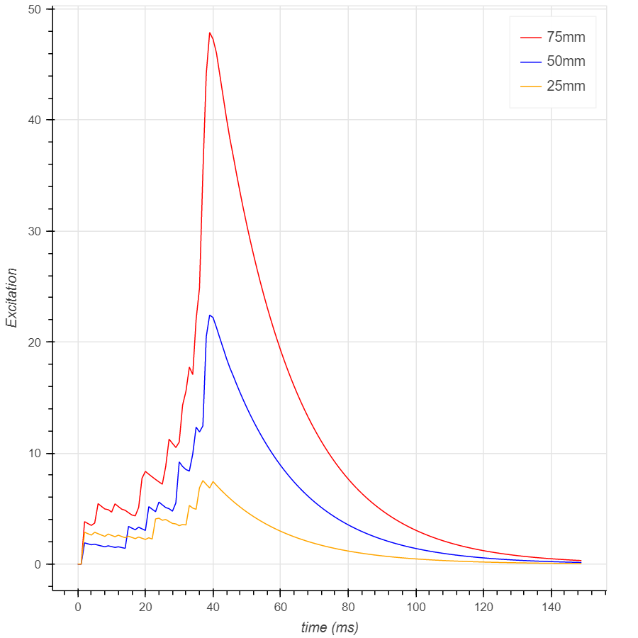
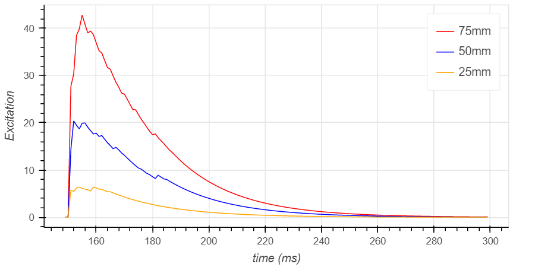
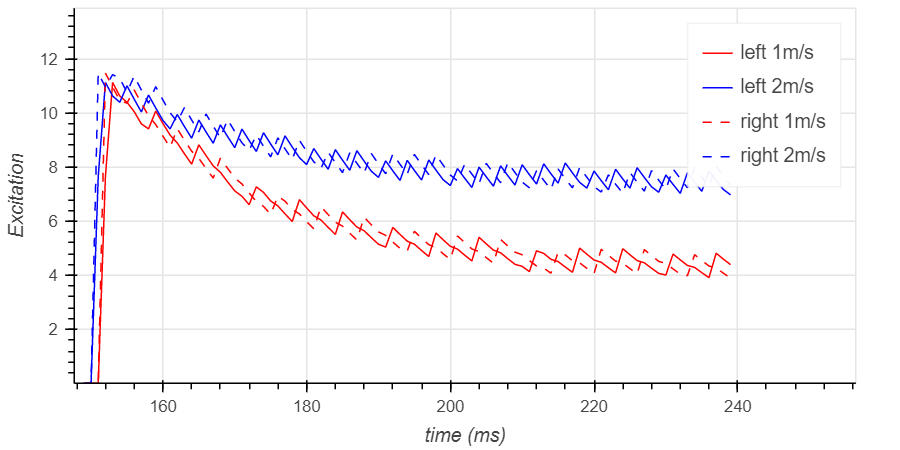

# LGMD
BME502 Final Project: lobula giant movement detector simulation from *jn.1996.75.3.967*

## Results

**Approaching Velocity:**

**Object Size:**

**Receding Object:**

**Directional Selectivity:**

## Movement Generator

The output of this module should be a grey scale value related to the input time and coordinates, which fakes a video of moving objects.

### Default Stimulus Parameters

| Stimulus | Edge Translation | Object Approach |
| :-:| :-: | :-: |
| Initial position $x, y, z,$ mm | -99, 0, 50 | 0, 0, 400 |
| Dimensions $l\times h,$ mm | 100×80 | 75×75 |
| Plane of motion, $(x,y,$ or $z)$ | $x$ | $z$ |
| Direction and distance, mm | 70 | -400 |
| Velocity, m/s | 0.75 | 10 |

### Image Generation

There's no need to generate an actual image. Lights can be delivered from the point of the hex to the object on the screen. A simple function can determine the illumination of this point since the object is a rectangle.

[Hexagon generation and mapping](notes/hex.md)