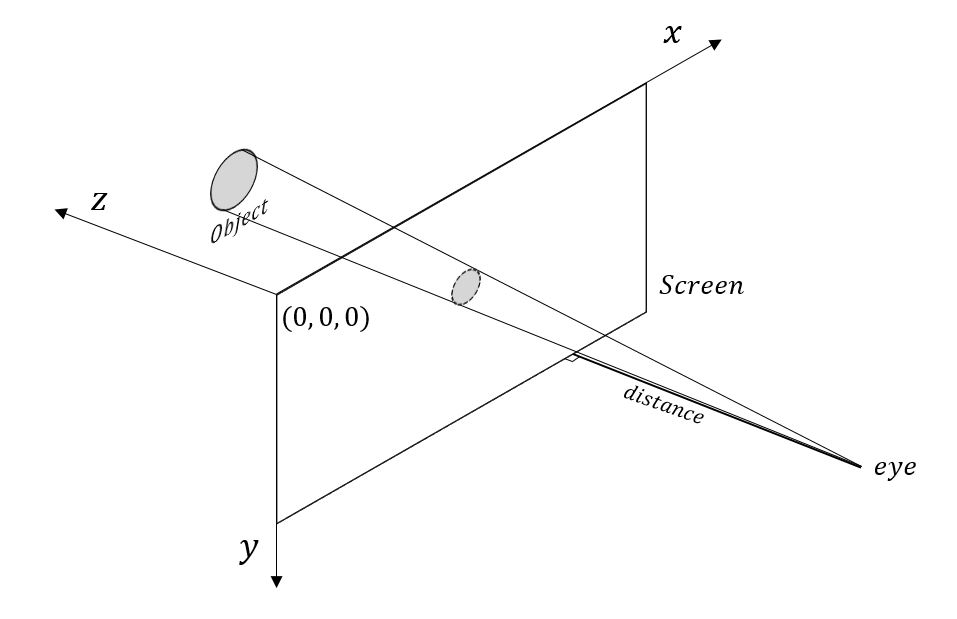

## Object Projection

We have to use perspective projection instead of orthographic projection because size of the object is important for our purpose. more details can be found on [3D_projection](https://en.wikipedia.org/wiki/3D_projection).

### Perspective projection

## Rectangle Object

Rectangle object maintain a list of position according to speed and interval to simulate movement.

To map the rectangle in space to the screen. First we need to map its origin (top left point) to the screen. Then calculate its width and height on screen to draw its projection. Rotation is not supported in this simple method.